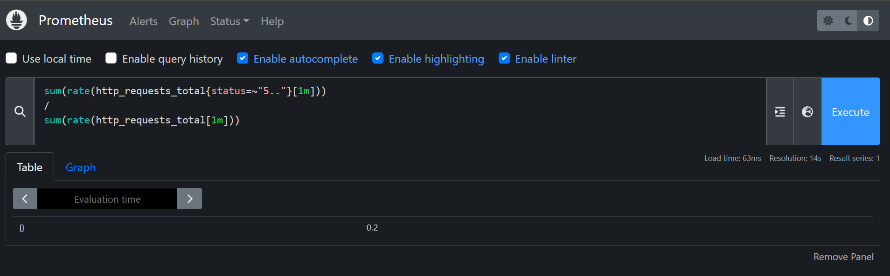
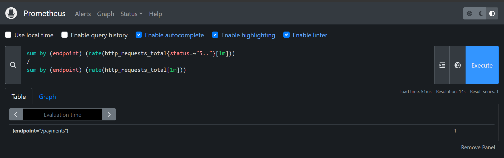
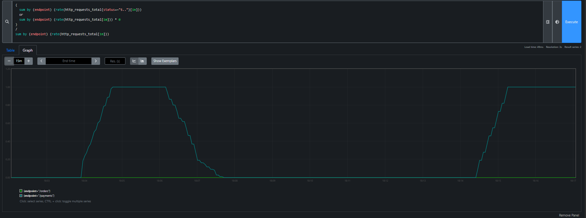
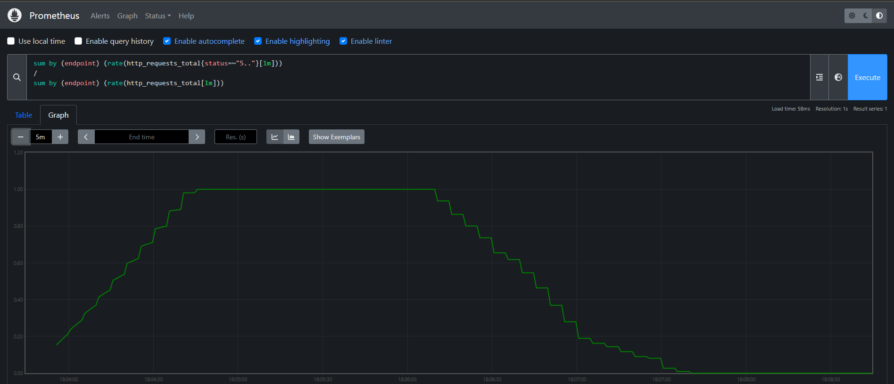

# Diagnosing HTTP Service Errors with Prometheus and PromQL

An executable tutorial. You run a small instrumented HTTP service, break one of
its endpoints, and use PromQL error-ratio queries to find which endpoint is
failing. It runs as a guided Killercoda scenario in about 20 to 30 minutes, or
locally with Docker Compose.


## Run it on Killercoda

**[Start the tutorial on Killercoda](https://killercoda.com/sund02/course/killercoda)**

You only need a free Killercoda account. The environment starts by itself and
each step has a Check button that verifies your progress.

## Run locally

Requires Docker with the Compose plugin.

```
docker compose up -d --build
```

Then open the Prometheus UI at <http://localhost:9090> and check
**Status → Targets**: the `app` target should be `UP` within about 10 seconds.

Stop and remove everything:

```
docker compose down
```

## Services

| Service | Port | Purpose |
|---|---|---|
| `app` | 8000 | Flask service with `/orders`, `/payments`, `/metrics` and the failure controls |
| `trafficgen` | none | Sends about 8 req/s to `/orders` and 2 req/s to `/payments` |
| `prometheus` | 9090 | Scrapes `app:8000/metrics` every 5 seconds and answers PromQL queries |

## Metrics

| Metric | Type | Labels |
|---|---|---|
| `http_requests_total` | Counter | `endpoint`, `status` |
| `http_request_duration_seconds` | Histogram | `endpoint` |

`endpoint` only takes the values `/orders` and `/payments`, so the number of
series stays fixed.

## Failure control

```
curl -X POST localhost:8000/admin/fail                    # fail /payments for every request
curl -X POST 'localhost:8000/admin/fail?rate=0.3'         # fail 30% of /payments requests
curl -X POST 'localhost:8000/admin/fail?endpoint=/orders' # fail /orders instead
curl -X POST localhost:8000/admin/recover                 # back to healthy
curl localhost:8000/admin/status                          # current state
```

The app always starts healthy. `FAIL_ENDPOINT` and `FAIL_RATE` in
`docker-compose.yml` set the defaults that `/admin/fail` uses.

## Key query

Error ratio per endpoint over the last minute:

```
sum by (endpoint) (rate(http_requests_total{status=~"5.."}[1m]))
/
sum by (endpoint) (rate(http_requests_total[1m]))
```

## Validation

The scenario was run end to end in a fresh Killercoda session on
2026-10-02, and the check for every step passed. The same sequence also passes
locally with `docker compose` and the verify scripts.

Overall error ratio during the incident: about 0.2, which looks survivable.



The same data grouped by endpoint: `/payments` fails every request.



Over time, `/payments` rises to 1 and falls back while `/orders` stays at 0.



After recovery the 1-minute ratio returns to 0 within about a minute.



All screenshots, one or more per step, are in
[docs/screenshots](docs/screenshots).

## Repository layout

```
app/                 instrumented Flask service and Dockerfile
trafficgen/          background traffic generator and Dockerfile
prometheus/          prometheus.yml scrape config
killercoda/          Killercoda scenario (promql-http-errors/): steps and verify scripts
docs/                architecture diagram, tutorial narrative, screenshots
docker-compose.yml   starts app, trafficgen and prometheus together
```

## License

[MIT](LICENSE)
