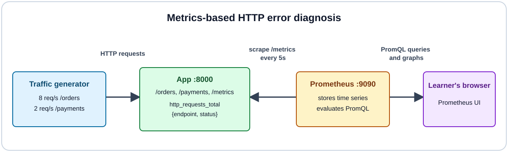

# Diagnosing HTTP service errors with Prometheus and PromQL

In this tutorial you observe healthy traffic, introduce a controlled failure,
diagnose the affected endpoint with PromQL, and verify recovery. It takes about
20 to 30 minutes and requires only a free Killercoda account, with nothing to
install.

## Intended learning outcomes

After this tutorial you will be able to:

1. Explain how an instrumented application exposes metrics and how Prometheus collects them.
2. Distinguish cumulative counters from request rates.
3. Write PromQL queries for request rate and error ratio grouped by endpoint.
4. Use metric labels to locate a failing endpoint and confirm recovery.
5. Explain the limitations of metrics-based diagnosis.

## How the environment works

A traffic generator sends requests to two endpoints on an instrumented HTTP
application. The application exposes request counters on `/metrics`, labeled
by endpoint and status code, and Prometheus collects those metrics every 5
seconds for querying and graphing.

## How to use this scenario

Setup starts automatically. Wait for `Environment ready.` in the terminal,
then click a command to run it and press **Check** to verify each step.
